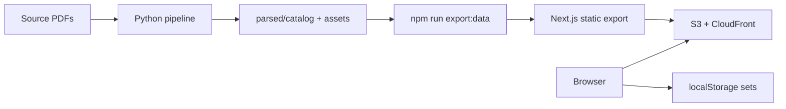

# Physics Problem Database

[](https://github.com/althaafsn/physics-database/actions/workflows/ci.yml)
[](LICENSE)
[](https://d28e99c7v2289t.cloudfront.net)

Browse Indonesian physics olympiad problems (OSK / OSP / OSN), build custom exam sets in the browser, and export PDFs via print — no backend, no login.

**[Live site](https://d28e99c7v2289t.cloudfront.net)** · **[Demo video](#demo)**

## Demo

Automated product walkthrough (Playwright + spotlight overlays). Full flow: library search → set builder → preview → print.

https://github.com/user-attachments/assets/581c7954-b054-4d22-a443-abfefe9fcba2

Regenerate locally: `npm run demo:record` · optional 4K upscale: `npm run demo:enhance` · [recorder docs](scripts/demo/README.md)

## Features

- **~439 problems** — curated corpus with LaTeX math (KaTeX) and diagram assets
- **Set builder** — search, add, reorder; saved sets in localStorage; starter templates
- **PDF export** — print preview → “Save as PDF” in the browser (no server-side PDF)
- **Static deploy** — Next.js export to S3 + CloudFront (~$0.50–$2/mo)
- **Ingestion pipeline** — Python tooling: PDF → structured JSON, LLM repair & English translation

## Quick start

```bash
git clone https://github.com/althaafsn/physics-database.git
cd physics-database
npm ci
npm run build:static
npm run preview:static   # http://localhost:3000
```

## Tech stack

| Layer | Stack |
|-------|-------|
| Frontend | Next.js 16, React 19, Tailwind CSS, KaTeX |
| Data | Static JSON + assets (no API server) |
| Deploy | S3 + CloudFront, Terraform |
| Pipeline | Python — ingest, validate, LLM repair/translate, catalog sync |

## Architecture



## Deploy

```bash
chmod +x deploy/aws/deploy.sh
./deploy/aws/deploy.sh
```

Details: [deploy/aws/README.md](deploy/aws/README.md) (IAM, Terraform, teardown).

## Data in the build

| Output | Source |
|--------|--------|
| Problem library | `parsed/catalog/problems.jsonl` → `public/data/catalog.*.json` |
| Figures | `parsed/assets/` → `public/assets/` |
| Starter set | `data/starter-sets.json` |

Source PDFs (`all_pdf/`) are not in this repo — only the parsed corpus is committed.

## Development

```bash
npm run export:data   # refresh public/data from corpus
npm run dev           # dev server
python scripts/sync_catalog.py   # after pipeline edits
```

Pipeline tests: `pytest` (see `tests/`).

## Project layout

```
app/              Next.js pages (static export)
components/       UI
lib/              Corpus mapping, localStorage sets, print helpers
parsed/           Gold/catalog corpus + assets
scripts/          Export, build, demo recorder
deploy/aws/       S3 + CloudFront (Terraform)
src/              Python ingestion / LLM pipeline
tests/            Pipeline unit tests
docs/demo/        Committed demo video for README
```

## License

MIT — see [LICENSE](LICENSE).
