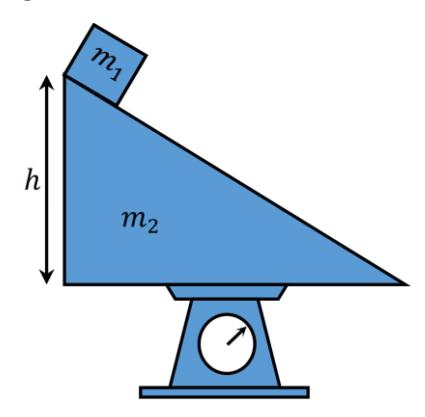

# Osk Mechanics Sample

## 1. Perbandingan Kecepatan Silinder Menggelinding dan Tidak Menggelinding

_OSK · 2005 · mechanics · `OSK-2005-04`_

Sebuah silinder massa dan jari-jari di atas bidang miring pada ketinggian ℎ dari dasar bidang miring. Kemudian silinder menggelinding. Jika momen inersia silinder ( = 2 /2). Tentukan perbandingan kecepatan saat silinder menggelinding dengan saat silinder tidak menggelinding di dasar bidang miring.

---

## 2. Sistem Tiga Balok dan Katrol dengan Gesekan Statis

_OSK · 2011 · mechanics · `OSK-2011-v2-05`_

Tinjau sistem empat benda seperti pada gambar. Sistem terdiri atas tiga balok homogen yang masing-masing bermassa $m_1$, $m_2$, dan $m_3$, serta sebuah katrol yang bermomen inersia $I$ dan berjari-jari $R$. Susunan sistem ditunjukkan pada gambar. Balok bermassa $m_1$ dan bertumpu pada lantai yang licin, dan koefisien gesek statis antara permukaan $m_1$ dan $m_3$ adalah $μ_s$, dengan $0 < μ_s < 1$. Balok bermassa $m_3$ dihubungkan oleh tali dengan sebuah benda bermassa $m_2$ melalui katrol. Jika diasumsikan katrol berputar tanpa slip, tentukan syarat massa $m_2$ agar kedua balok $m_1$ dan $m_3$ bergerak bersama-sama. Nyatakan hubungan antara $m_2$ dengan semua besaran yang terlibat, yaitu $m_1$, $m_3$, $I$, $R$, dan $μ_s$.

---

## 3. Balok dan Bidang Miring di Atas Timbangan

_OSK · 2017 · mechanics · `OSK-2017-05`_

Sebuah balok kecil (massa 1) berada di atas suatu bidang miring (massa 2, sudut kemiringan ) yang diletakkan di atas alat timbangan berat (lihat gambar). Diketahui bidang miring memiliki keringgian ℎ dan titik pusatnya berada pada ketinggian ℎ/3 dari alas bidang miring. Sementara itu pada saat awal, titik pusat massa balok $m_{1}$ berada di ketinggian ℎ dari alas bidang miring. Asumsikan bidang miring licin dan terikat pada timbangan. Tentukan:

- (a) letak posisi vertikal pusat massa sistem balok- bidang miring tersebut.
- (b) komponen vertikal kecepatan pusat massa sistem tersebut dinyatakan sebagai fungsi waktu , saat balok kecil tergeser/bergerak ke bawah di atas permukaan bidang miring.
- (c) posisi vertikal pusat massa sistem tersebut sebagai fungsi waktu.
- (d) nilai pembacaan pada alat timbangan berat saat balok kecil mulai bergeser.

(a) letak posisi vertikal pusat massa sistem balok- bidang miring tersebut.

(b) komponen vertikal kecepatan pusat massa sistem tersebut dinyatakan sebagai fungsi waktu , saat balok kecil tergeser/bergerak ke bawah di atas permukaan bidang miring.

(c) posisi vertikal pusat massa sistem tersebut sebagai fungsi waktu.

(d) nilai pembacaan pada alat timbangan berat saat balok kecil mulai bergeser.

---

## 4. Balapan Empat Mobil

_OSK · 2019 · mechanics · `OSK-2019-03`_

Empat buah mobil masing-masing A, B, C, dan D melaju di jalan tol dua arah (timur-barat) dengan kecepatan konstan. Mobil A, mobil B, dan mobil C bergerak ke timur, sedangkan mobil D bergerak ke barat. Diketahui :

- Mobil A menyalip mobil B pada pukul 10.00.
- Mobil A menyalip mobil C pada pukul 11.00.
- Mobil A berada pada posisi yang sama dengan mobil D pada pukul 12.00.
- Mobil B berada pada posisi yang sama dengan mobil D pada pukul 14.00.
- Mobil C berada pada posisi yang sama dengan mobil D pada pukul 16.00.
- (a) Tentukan kapan mobil B menyalip mobil C!
- (b) Ketika suatu rentang waktu tertentu di tinjau dari timur ke barat, urutan mobil berturut-turut adalah A–D–B– C, tentukan kapan ketika mobil B berada tepat ditengah- tengah antara mobil D dan C.

(a) Tentukan kapan mobil B menyalip mobil C!

(b) Ketika suatu rentang waktu tertentu di tinjau dari timur ke barat, urutan mobil berturut-turut adalah A–D–B– C, tentukan kapan ketika mobil B berada tepat ditengah- tengah antara mobil D dan C.

---

## 5. 6) Sebuah peluru ditembakkan vertikal ke atas dengan kecepatan awal tertentu dari titik A yang be...

_OSK · 2022 · mechanics · `OSK-2022-06`_

6) Sebuah peluru ditembakkan vertikal ke atas dengan kecepatan awal tertentu dari titik A yang berada pada ketinggian 68 meter di atas permukaan tanah. Diketahui kecepatan peluru pada ketinggian 35 meter di bawah A sama dengan dua kali kecepatan peluru pada ketinggian 35 meter di atas A. Abaikan hambatan udara. Percepatan gravitasi sama dengan . Tinggi maksimum yang dicapai peluru diukur dari permukaan tanah adalah ... meter.

#### **Hukum Newton**
